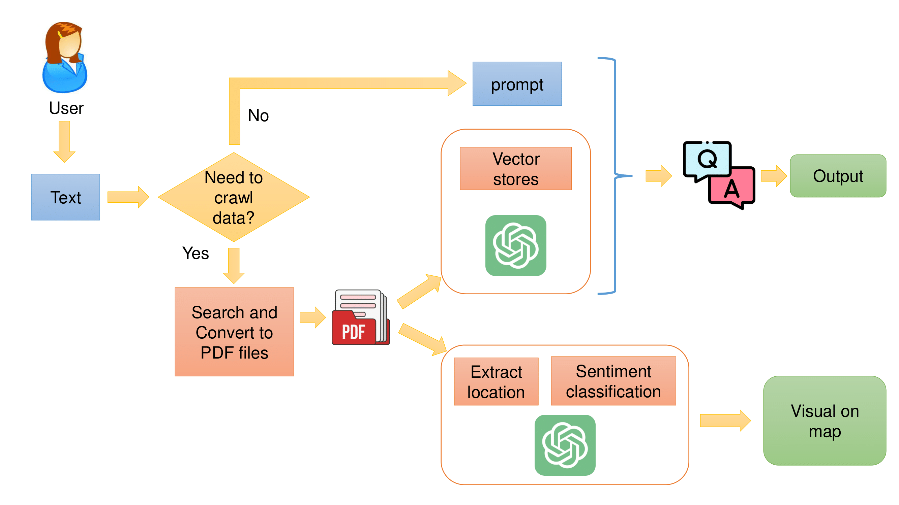

# SOICT 2024

# Title
GeoSI - An interesting interactive system to assist people in retrieving news from multiple online sources and mapping it through maps

# Authors
| No. | Author                        | Email |
|-----|-------------------------------|-------|
| 1   | Minh-Nhat Nguyen*           | 21120107@student.hcmus.edu.vn |
| 2   | Trong-Nghia Tran* | 21120507@student.hcmus.edu.vn |
| 3   | Minh-Triet Tran**  | tmtriet@fit.hcmus.edu.vn |

***  Both authors contribute equally.
****  Corresponding author

# Description
This source code implements GeoSI, submitted to SOICT 2024. It is a question-answering system that utilizes the latest online data and organizes information on a map to analyze trends specific to different regions.

# Workflow

  
  <figcaption>Overall Workflow</figcaption>

# Testing pipeline

Please refer to this [Colab link](https://colab.research.google.com/drive/15RsJgG7nXEvnN5-ERo7MhZtJWrqoCxQO?usp=sharing) to run a test of the system's pipeline.
